# The-one-with-all-the-characters
[Go Back](https://lunahub.github.io/Friends_social_data_analysis_2019/)

Your are probably already fimiliar with the 6 main characters of friends (otherwise go [here](https://lunahub.github.io/Friends_social_data_analysis_2019/network_analysis_main_char)). However there are a number of secondary characters that appear quite alot in the show. But how often do they appear? And who are the "main" secondary characters of the show?
This section will explore the features of the social network of the complete cast of all seasons along with the networks of each season to investigate the evolution over seasons. 

 

The following figures show the complete social network of all charaters in the entire show of F.R.I.E.N.D.S. 
Hover on the image to show labels of the smaller nodes. You can also hover on the images below to show the network of each season.

 
	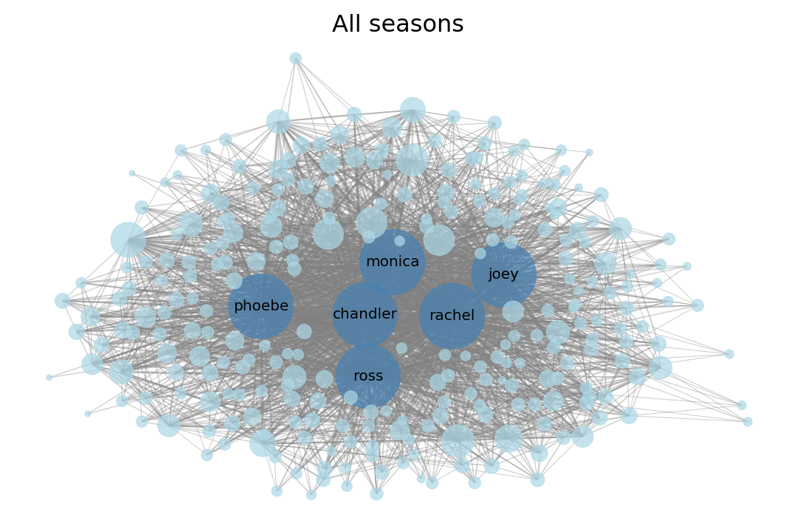

 
  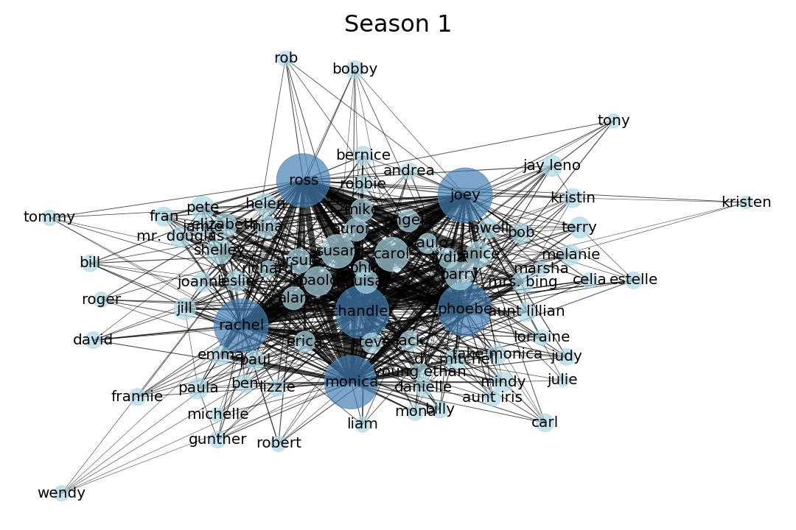
  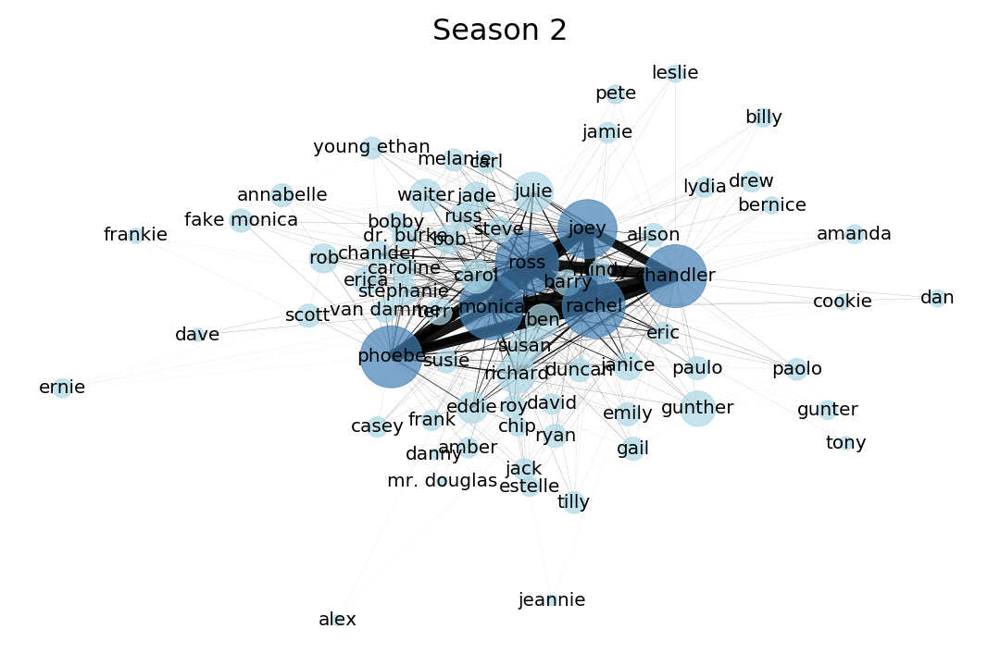
  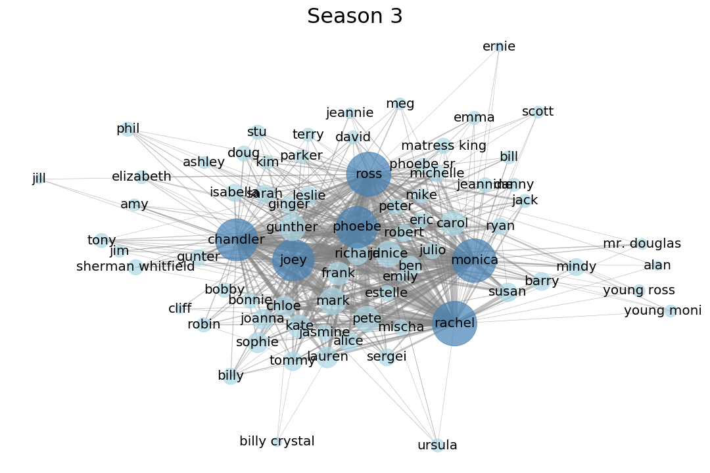
  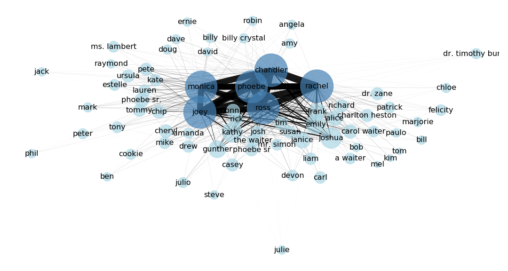
  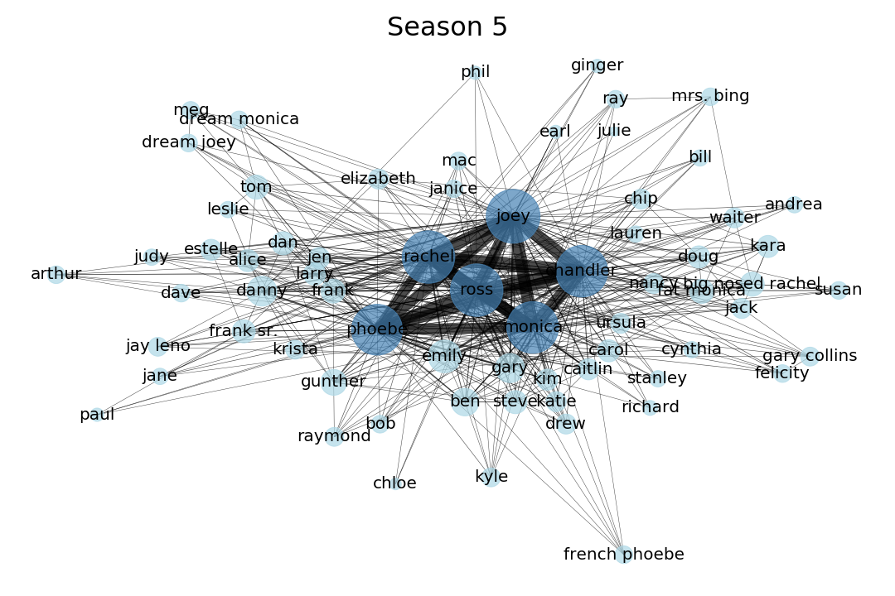
  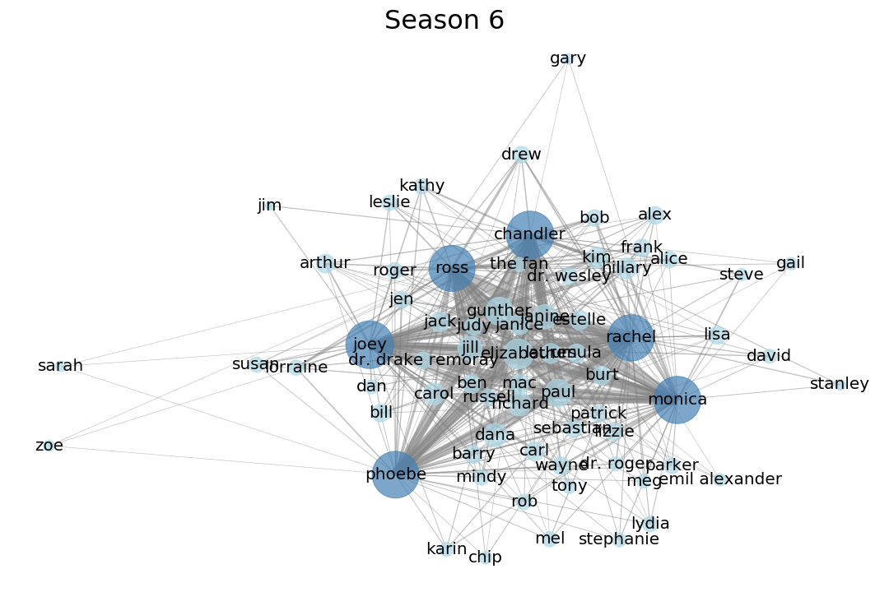
  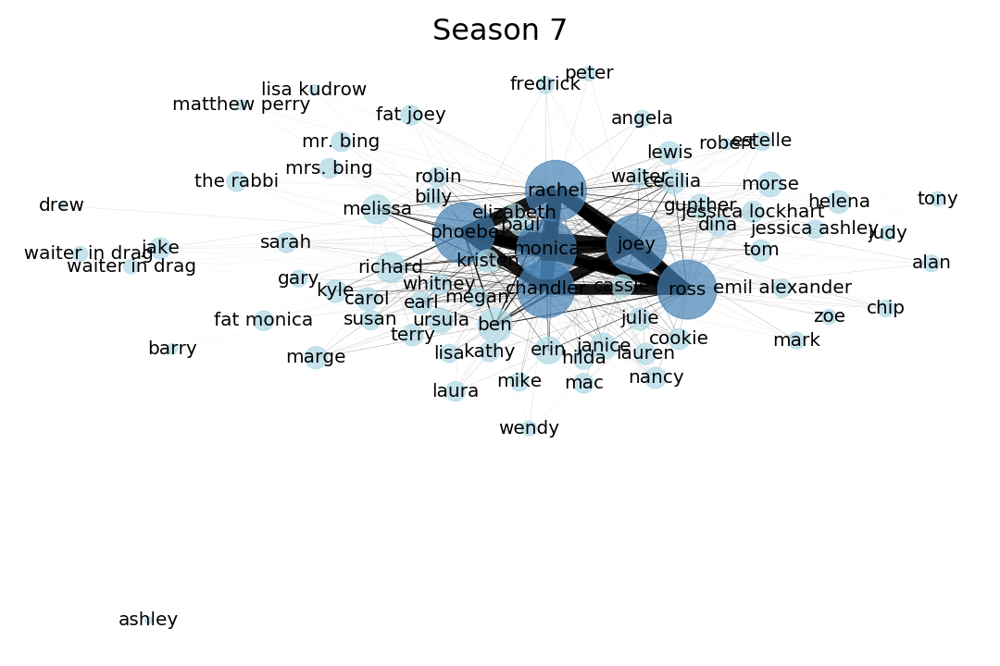
  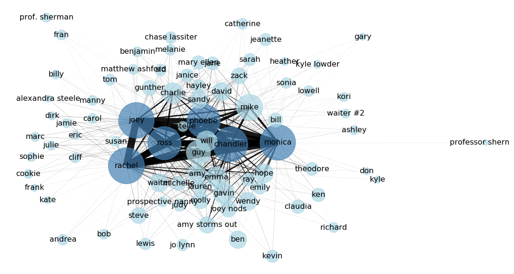
  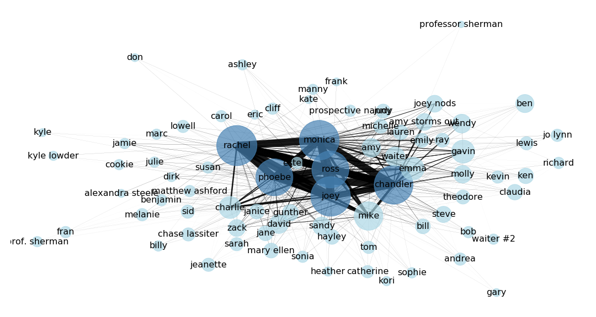
  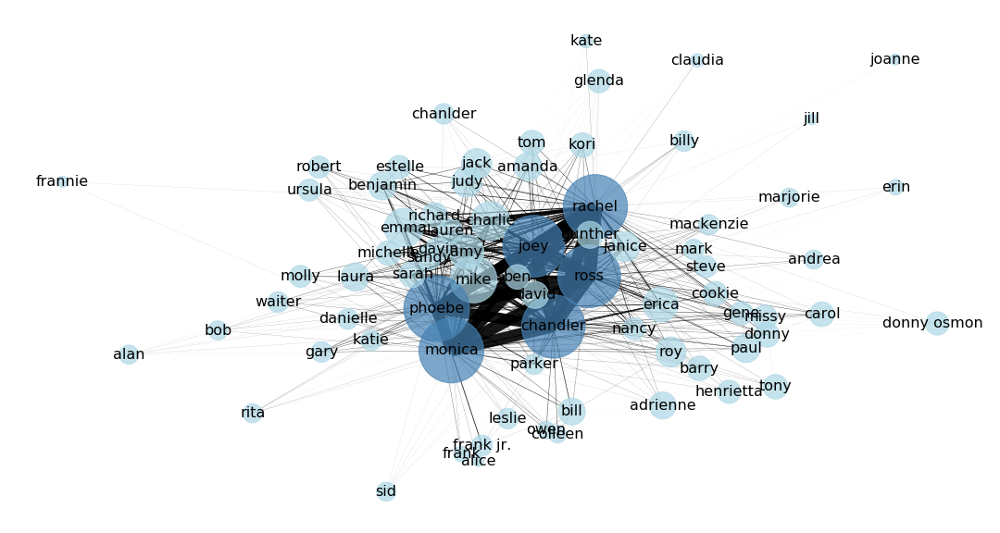

Each node represent a character that appeared in the show. The nodes are connected if the characters appear in the same scene or are mentioned in scene. The size of each node is based on how many connections a character has, ie. larger nodes means that the character has many connections. The thickness of the line drawn between each nodes is related to how many times the two characters are connected. Thick lines means that the more connected. As shown in the analysis of the main characters, the link between the main characters are quite strong. As this section aims at exploring the secondary characters of the show, the links between the main characters are excluded for a nicer visualization. 

As you might notice the network does not give alot of information, so lets dig in the features of the network.

## Network statistics
The complete network of all casted characters of the show includes 276 charatcers and a total of 2554 links between the characters. The number of characters and links between these in each season is seen in the figures below. The number of characters and links do not vary alot between seasons.

 
	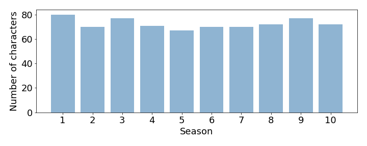

 
	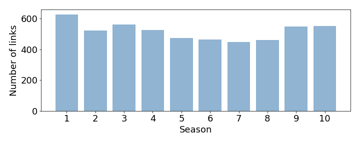

The degree distribution is seen in the Figure below. Degree is a measure of how many connection a character has. The Figure show that the majority of the characters have 5 to ten connection to other characters. A small fraction of characters however have +50 connections to other characters. It is assumed that these are the main characters. It is also clear that the destribution is similar in all seasons. The distribution is a poisson distribution which is the characteristic of a random network. The distribution is however right-skewed which approximates the power distribution that characterize scale-free real social network.

 
	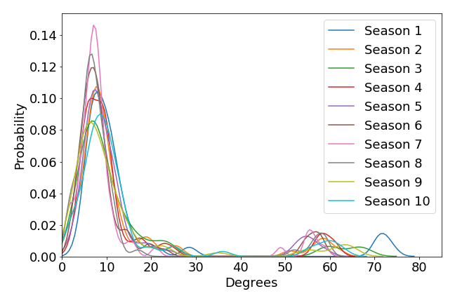

## Secondary characters
The show is mostly about the lifes of the six main characters. However a number of secondary characters also play an important role in the storyline. The first Figure below show how many connection to other characters each of the main characters have in each season. The main characters have most connection to other characters in the first season. But otherwise the number of connections are quite similar between the main characters and in each season.

 
	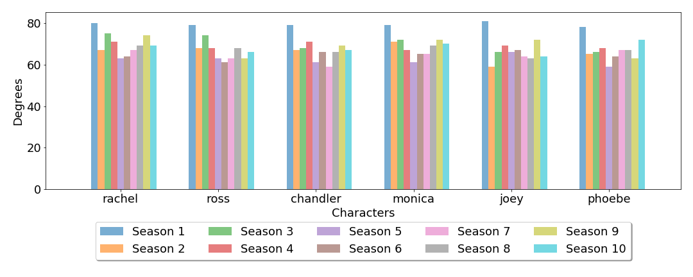

It is however more interesting to explore who the most important characters, beside the main characters, of the show is. The first Figure below show the three most important secondary characters in each season and in all of the season. This Figure is based on the how many connections the secondary characters has. 

 
	

The most important characters in all seasons are Gunther, Carol and Mike. This fits nicely with the storyline of the show; Gunther is a waiter at the cafe where the characters spend a lot of time and Carol and Mike is respectively an exwife and a boyfriends of some of the main characters. Knowing the storyline of the show the characters that are most important in each season fits well.

Another way to investigate the most important sencodary characters is to look at how many times they appear. The Figure below show how many characters appeared in one season, two seasons, three seasons etc. There is a lot of characters that only appear in one season and the number then decreased with increasing number of seasons. However a peak of aorund 20 characters actually appear in all 10 seasons.

 
	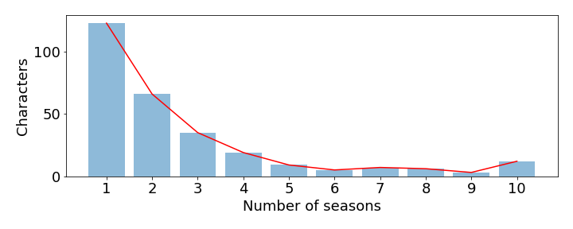

### Networks of secondary characters
Lets take a look at the who the most important sencondary chracters are based on the number of connections to other characters and based on how many seasons they appear. The interactive graph below show the two networks. The size of the nodes are based on how many connections the character has in the full network. The green network is the based on the characters appearing in 8 or more seasons and the blue is based on the 10 most connected characters.

	 

Both network ofcourse includes the six main characters. The analysis found that the secondary characters that appear in eight or more seasons are; Tony, David, Gunther, Bob, Ben, Jack, Susan, Carol, Lauren, Richard, Janice, Ursula and Estelle. The 10 most connected characters are; Susan, Carol, Ben, Mike, Gunther, Janice, Richard, Emily, Emma and Frank. Knowing the storyline of the show, the characters found by the last analysis fits best. The first analysis finds characters that are not really part of the storyline. Eg. the character "Bob" is not an important character. But the name is apparently mentioned alot by the other characters in different contexts, which is why it is found by our analysis.

## Communitites
Each of the main characters are connected to a number of secondary characters and some of the main characters are also connected to the same secondary characters. The Figure below show how the Louvain algorithm cluster the characters into communities. The algorithm found a total of six communities; five that each includes one or two of the main characters and one that does not. The algorithm clustered Monica and Chandler together in one community. This makes sense as the two are in a relationsship from seasons four and ends up married. The community that do not include any of the main characters however includes most of the most important secondary characters.

 
	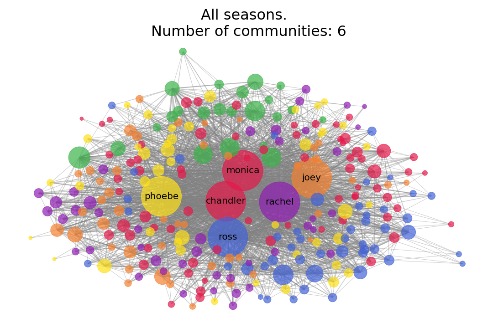

The number of characters in each community is seen in the Figure below. It is clear the Ross/Rachel community is the largest and that the commnity with non of the main characters is the smallest.

 
	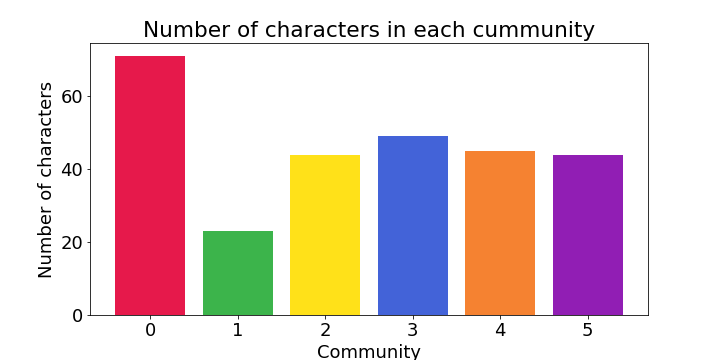

## Friendship paradox
A known phenomenon within sociology is the Friendship Paradox. It states that almost all of your friends will have more friends than you. Lets exlore this for the characters in the show. The analysis show that the frinedship paradox is true for 264 of the 276 characters, which is equal to 95%.

 
	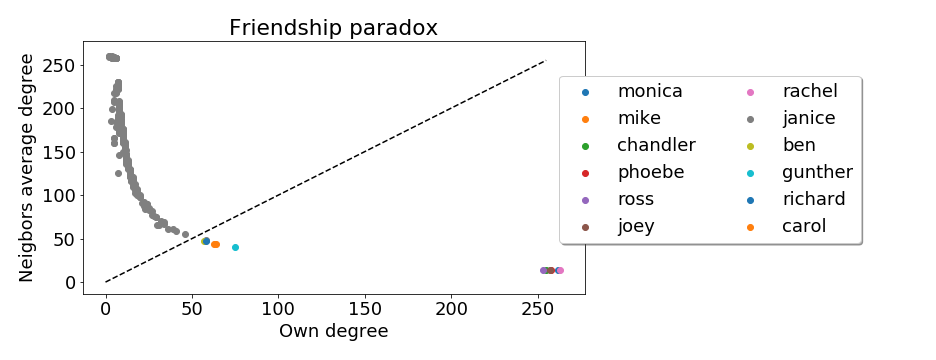

The Figure above show the number of connection for each character related to the average number of connections for the characters connections. The line indicates the friendship paradox. The characters that do not fulfill the friendship paradox is non-suprissingly also the most central characters. The Figure below show the centrality based on the number of connections, of the characters that do not fulfill the friendship paradox.

 
	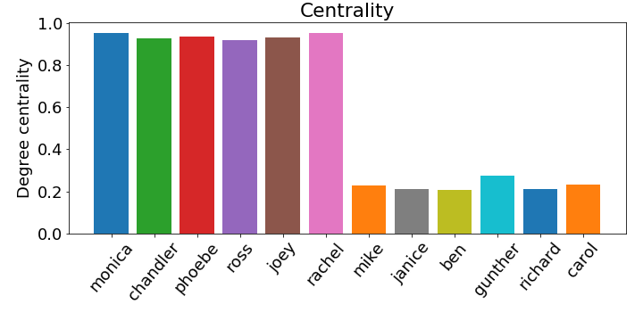

[Go Back](https://lunahub.github.io/Friends_social_data_analysis_2019/)
