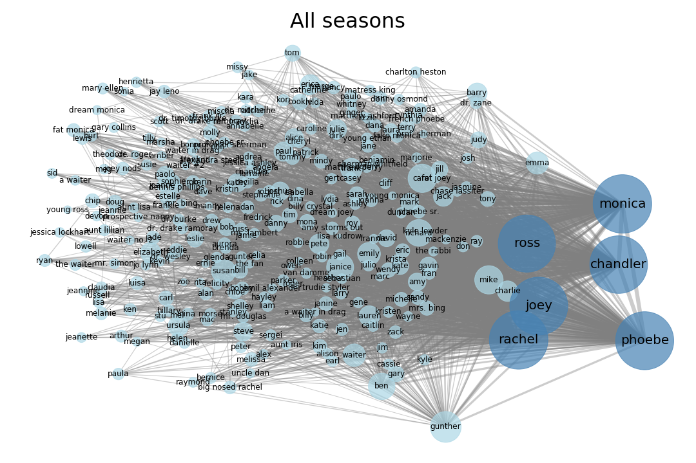

# The-one-with-all-the-characters
[Go Back](https://lunahub.github.io/Friends_social_data_analysis_2019/)

The following show the complete network of all charaters in entire show of F.R.I.E.N.D.S. Hover on the images below to show network of each season.

 

 
  
  
  
  
  
  
  
  
  
  

[Go Back](https://lunahub.github.io/Friends_social_data_analysis_2019/)
