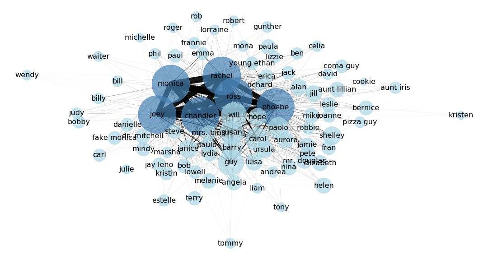

# Network Analysis: 
## The-one-with-all-the-characters
[Go Back](https://lunahub.github.io/Friends_social_data_analysis_2019/)

The following show the complete network of charaters in each season...

 

 

 

 

 

 

 

 

 

 

[Go Back](https://lunahub.github.io/Friends_social_data_analysis_2019/)
