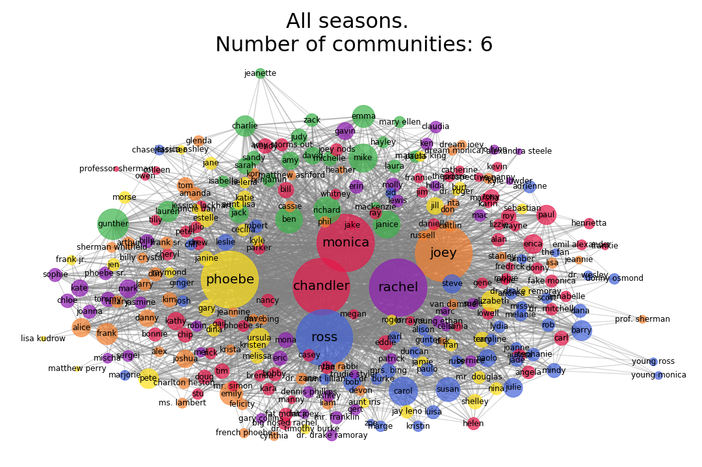

# The-one-with-all-the-characters
[Go Back](https://lunahub.github.io/Friends_social_data_analysis_2019/)

Your are probably already fimiliar with the 6 main characters of friends (otherwise go [here](https://lunahub.github.io/Friends_social_data_analysis_2019/network_analysis_main_char)). However there are a number of secondary characters that appear quit alot in the show. But how often do they appear? And who are the "main" secondary characters of the show?
This section will explore the features of the network of the complete cast of all seasons along wiht the networks of each season to investigate the evolution over seasons. 

 

The following show the complete network of all charaters in entire show of F.R.I.E.N.D.S. 
Hover on the images below to show network of each season.

 
	

 
  
  
  
  
  
  
  
  
  
  

How are nodes and link made...

As you might notice the network does not give alot of information, so lets dig in the features of the network.

## Network statistics
The complete network of all casted characters of the show includes 285 nodes(charatcers) and 2683 links. The number of characters and links between these over each season is seen in the figures below. The degree distribution is also seen..

 
	

 
	

 
	

## Secondary characters

 
	

 
	

 
	

### Networks of secondary characters
This is the network of the most frequenct appearing characters

 
	 

 

## Communitites

 
	

Some text...

 
	

## Friendship paradox

 
	

[Go Back](https://lunahub.github.io/Friends_social_data_analysis_2019/)
