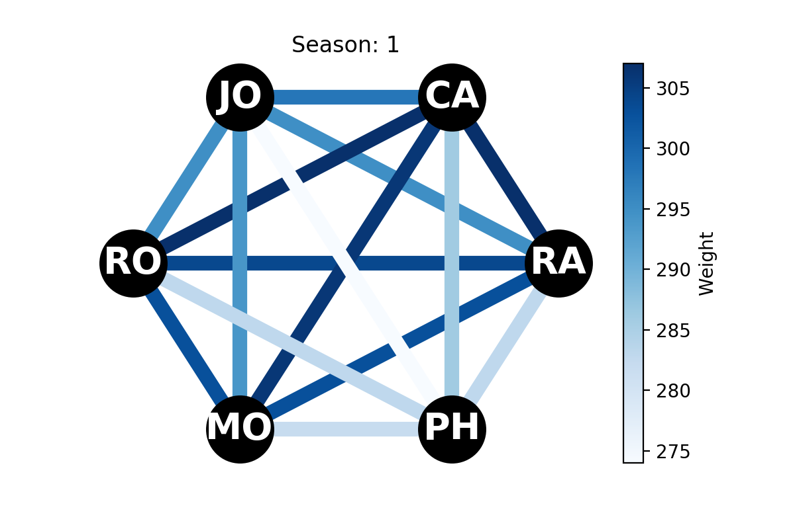
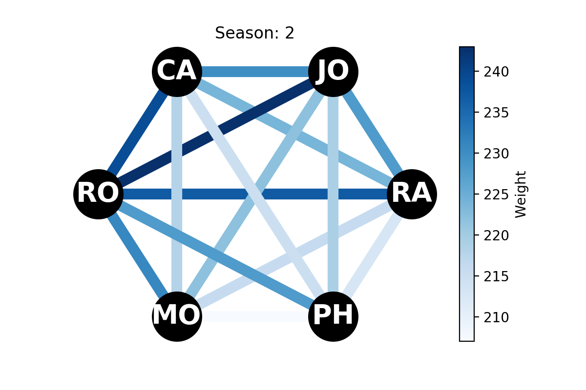
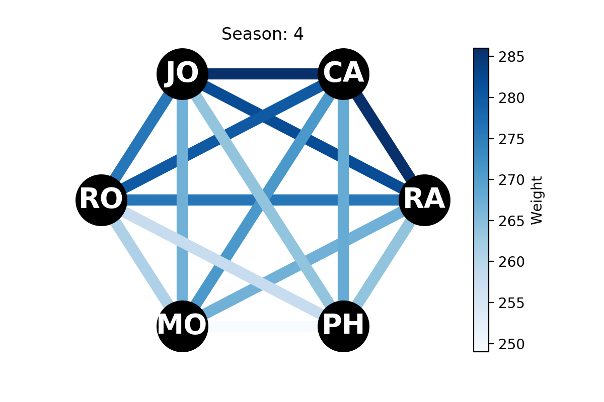
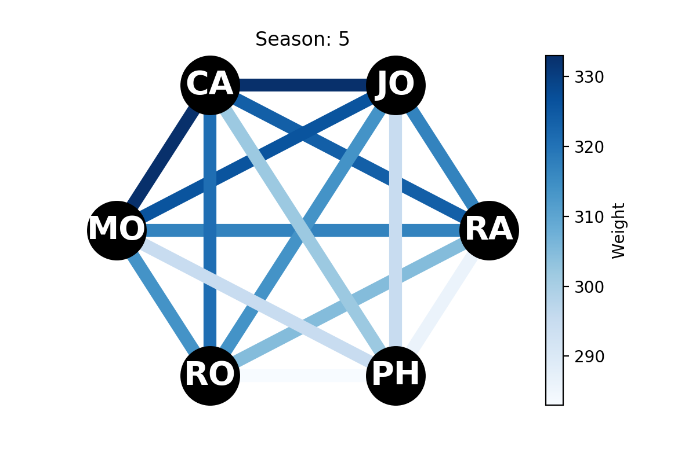
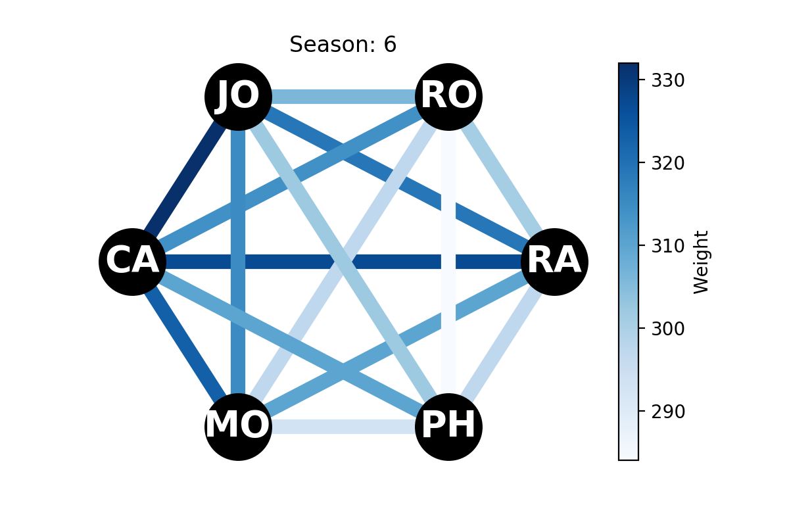
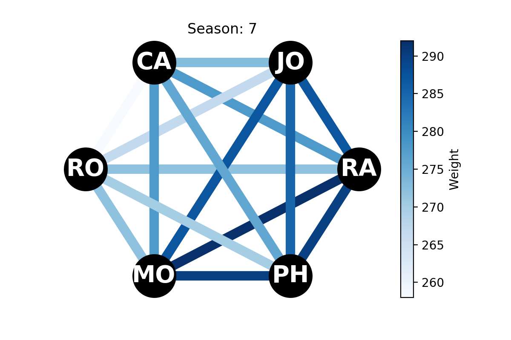
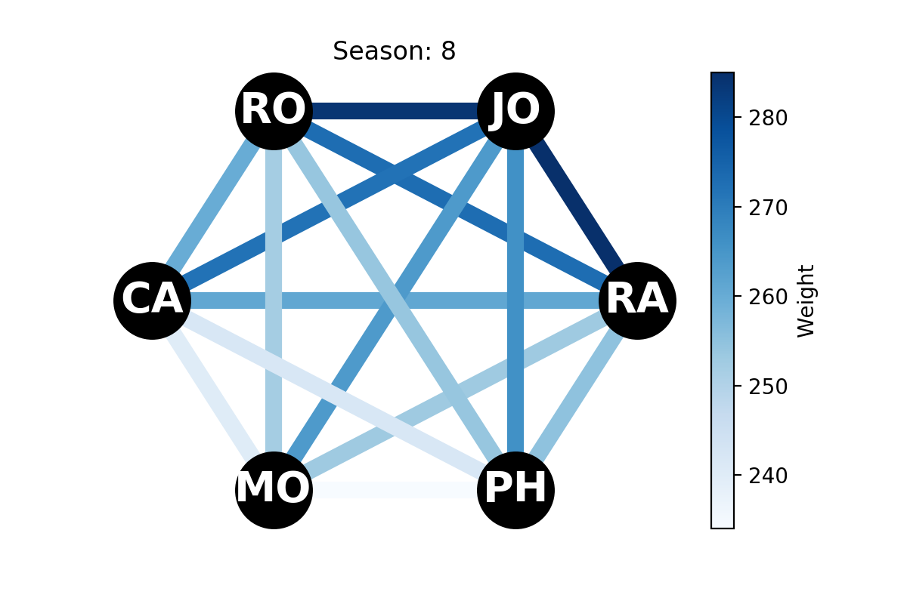
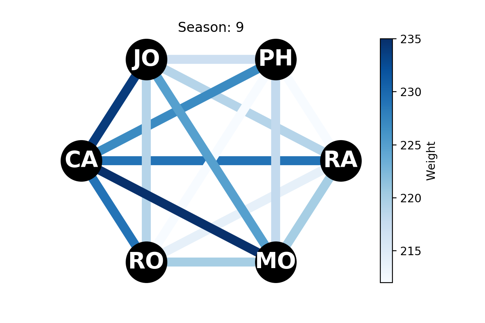

# Network Analysis: 
## The-one-with-the-main-characters V.1.3
[Go Back](https://lunahub.github.io/Friends_social_data_analysis_2019/)

The 6 main characters in the show Rachel, Joey, Chandler, Ross, Monica and Phoebe have a very dynamic relationship. The diffrent relationships are varying from roommates, friends, partners or even enemies sometimes.

 

By using network analysis we can investergate how the relationship between the characters devolop for each season. 
The network is based on the characters appearance in each scene. So if two main characters appears in the same scene, an edge between them is created. The result of this is a weighted undirected-network for each season, as shown below

 

 

 

 

 

The mean of the weight is around ~250 for each season.
From the network we found that the overall strongest edge is between Chandler and Joey in season 5, with a weight of 333. This means that the 2 characters have appeared together in same scene 333 times in season 5!

If you have seen the show you know that the two characters Ross and Rachel have a very complicated relationship through the show. By plotting the weight of the edge we can show how their relationship evolves. Because the number of scenes for each season is varying, we want to look at weight relative to the sum of all weights for each season.

insert plot of rach and ross relationship.

The last three seasons their weight is very fluctuating. This makes sense because in season 8 Ross and Rachel gets a baby, in season 9 they are broken up, but in the season 10 they end up toghether. They also have the strongest weight in season 10.

insert funny ross and rachel GIF.

