# The-one-with-the-main-characters 
[Go Back](https://lunahub.github.io/Friends_social_data_analysis_2019/)

The 6 main characters in the show Rachel, Joey, Chandler, Ross, Monica and Phoebe have a very dynamic relationship. The different relationships are varying from roommates, friends, partners or even enemies sometimes.

 

By using network analysis, we can investigate how the relationship between the characters develop for each season. 
The network is based on the characters appearance in each scene. If two main characters appears in the same scene, an edge between them is created. The result of this is a weighted undirected-network for each season, as shown below

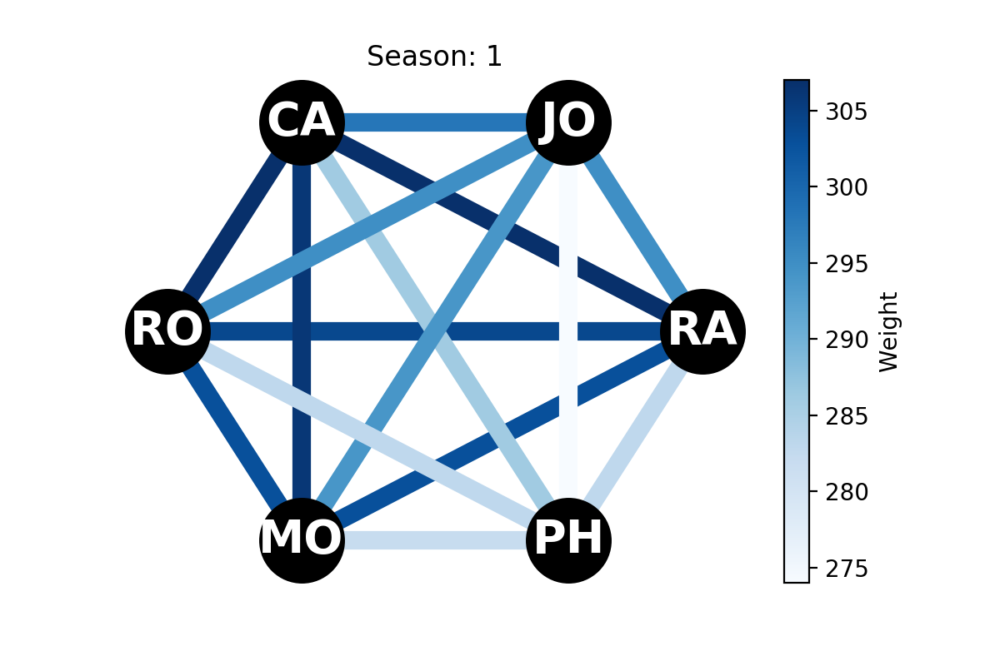 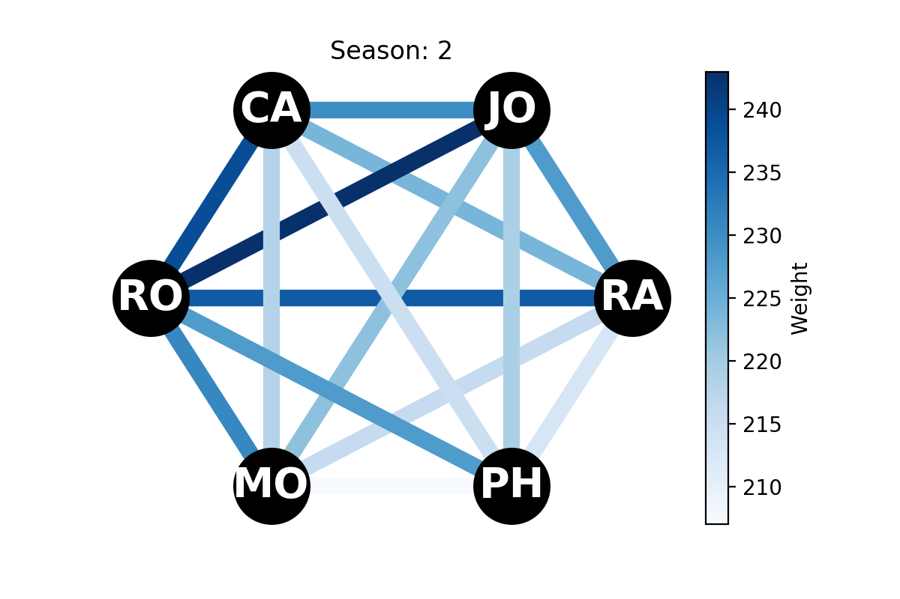

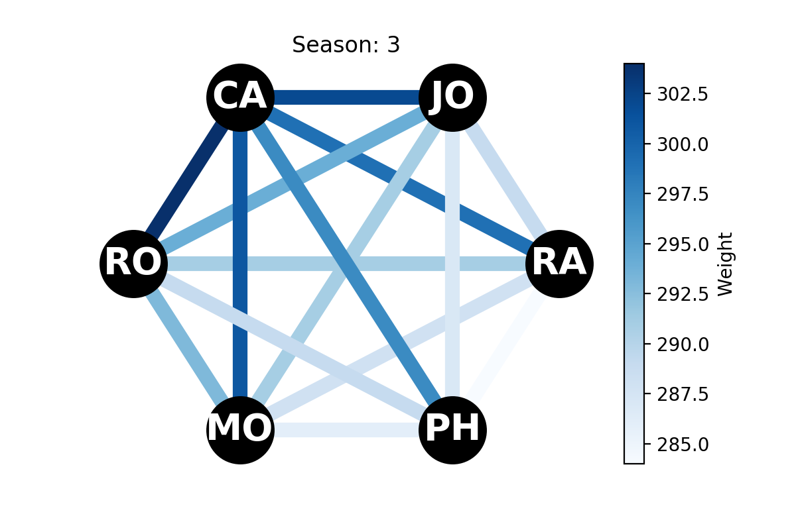 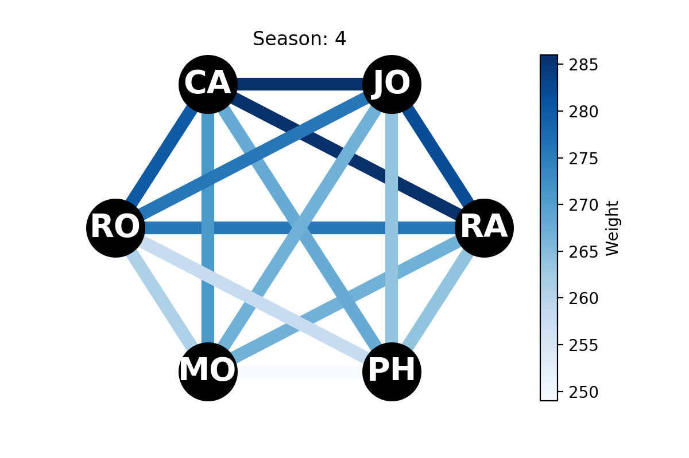

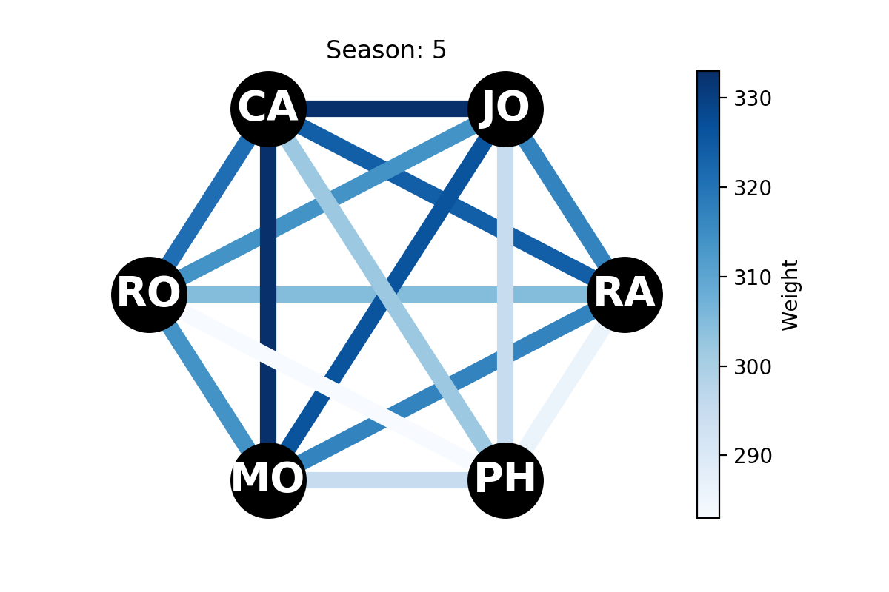 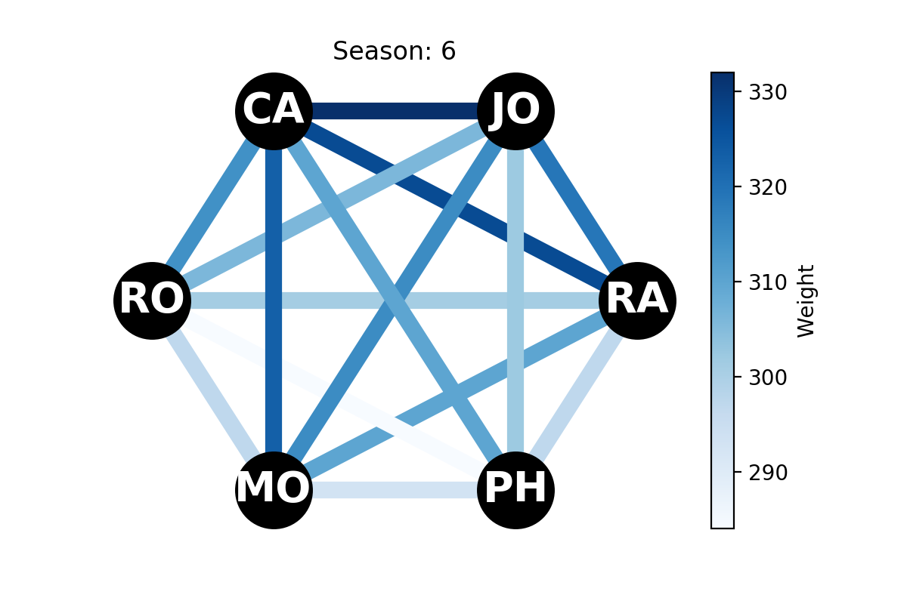

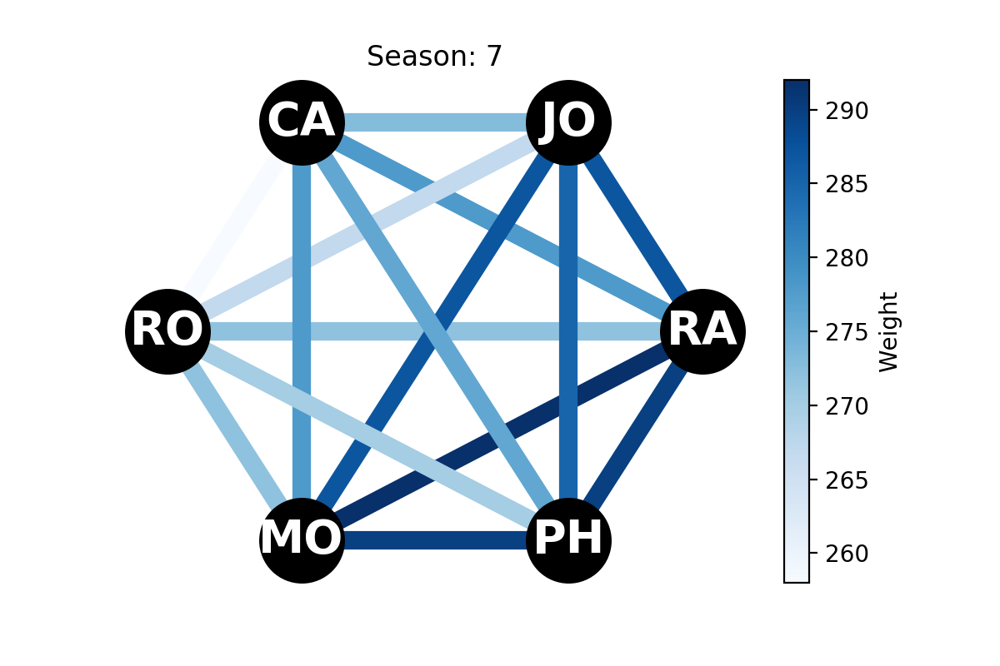 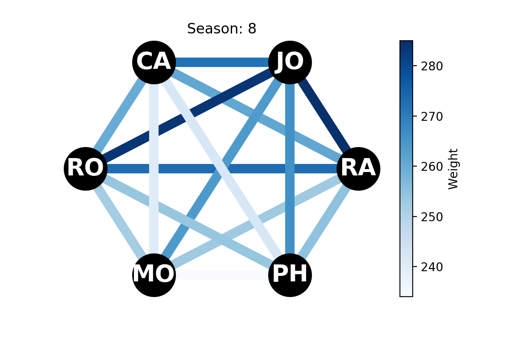

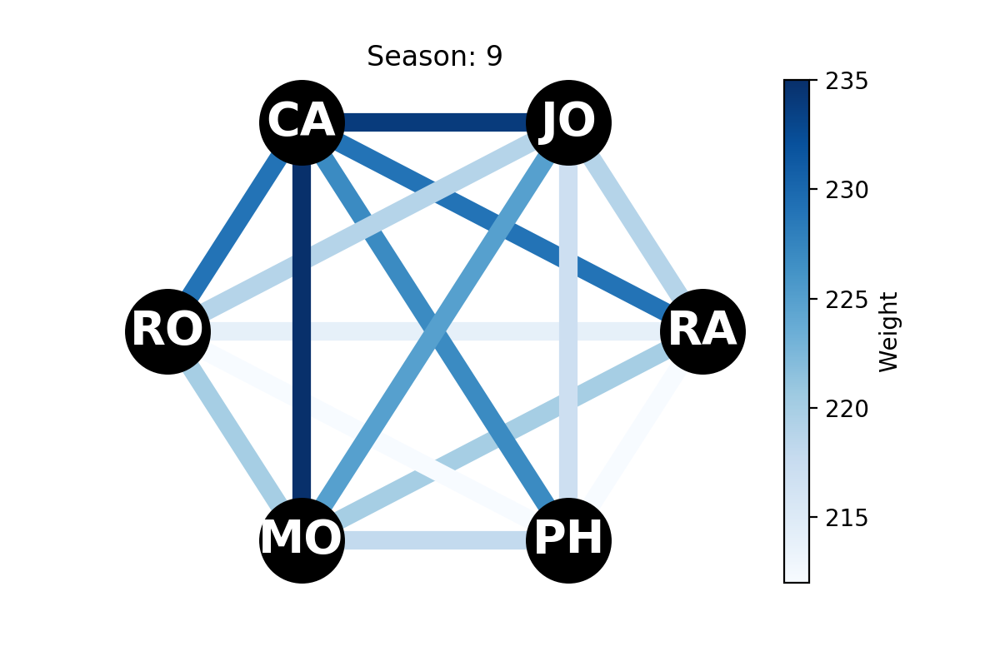 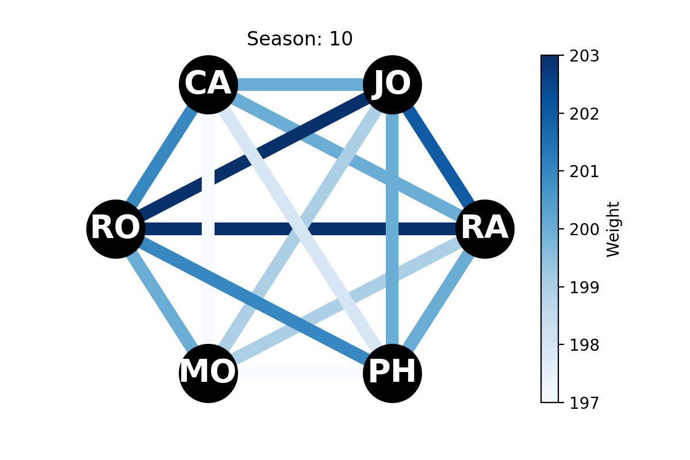

The following plot shows the weight of each relationship of the 6 main characters. Because the number of scenes is varying the weight is calculated relative to the number of scenes in each season. 

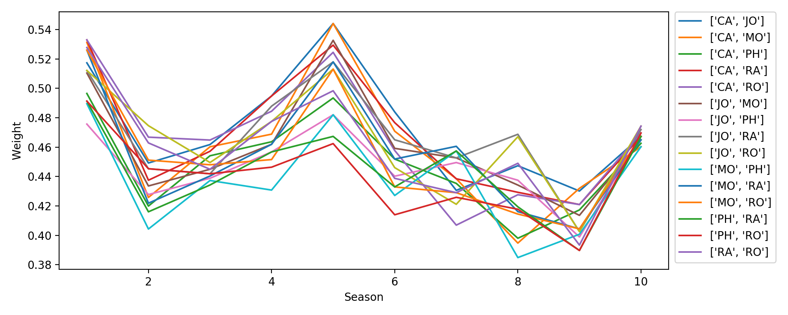 
 
The highest relative weight is Joey and Chandler in season 5 at 0.54! This means that Joey and Chandler appears together in 54 % of all the scenes in season 5!

 

## Ross and Rachel
If you have seen the show you know that the two characters Ross and Rachel have a very complicated relationship through the show. By plotting the weight of the edge, we can show how their relationship evolves.

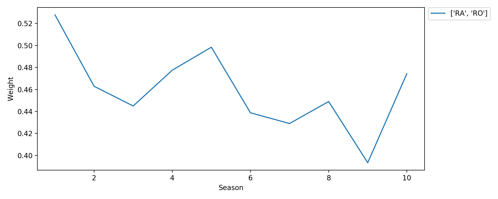 

We can compare this to the number of scenes where Ross and Rachel are the only one present.

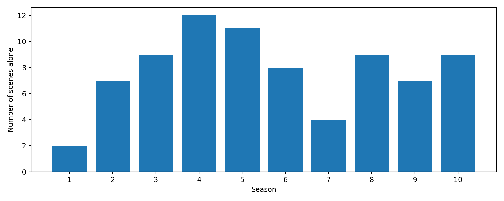

By comparing the two graphs it shows, that even though they spend a lot of times together in the beginning of the show, they are not necessarily spending time apart from the rest of the group. This could be an indication that they don't have a romantic relationship in the beginning of the show.

The last three seasons their weight is very fluctuating. This makes sense because in season 8 Ross and Rachel gets a baby, in season 9 they are broken up, but in season 10 they end up together.

[Go Back](https://lunahub.github.io/Friends_social_data_analysis_2019/)
