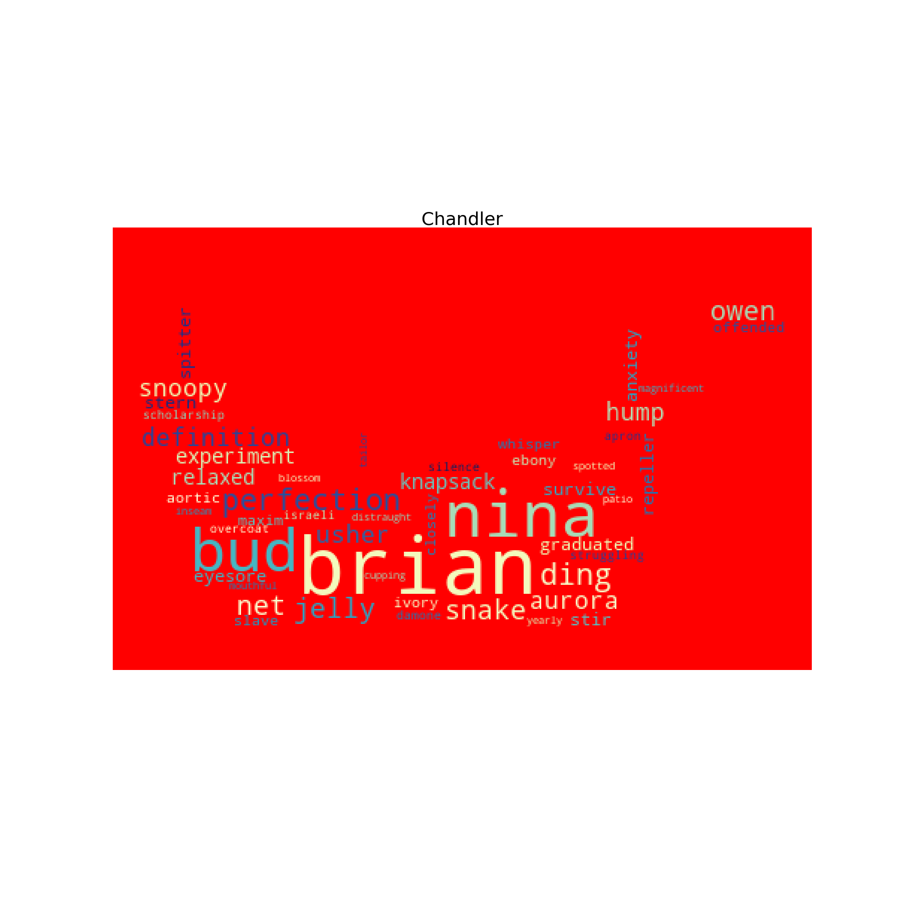
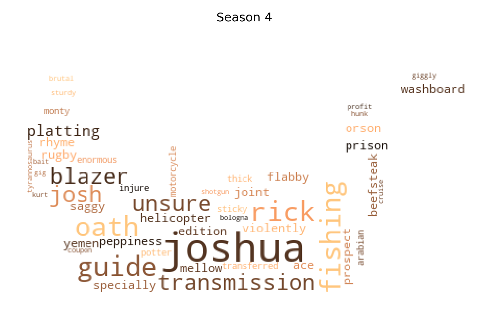
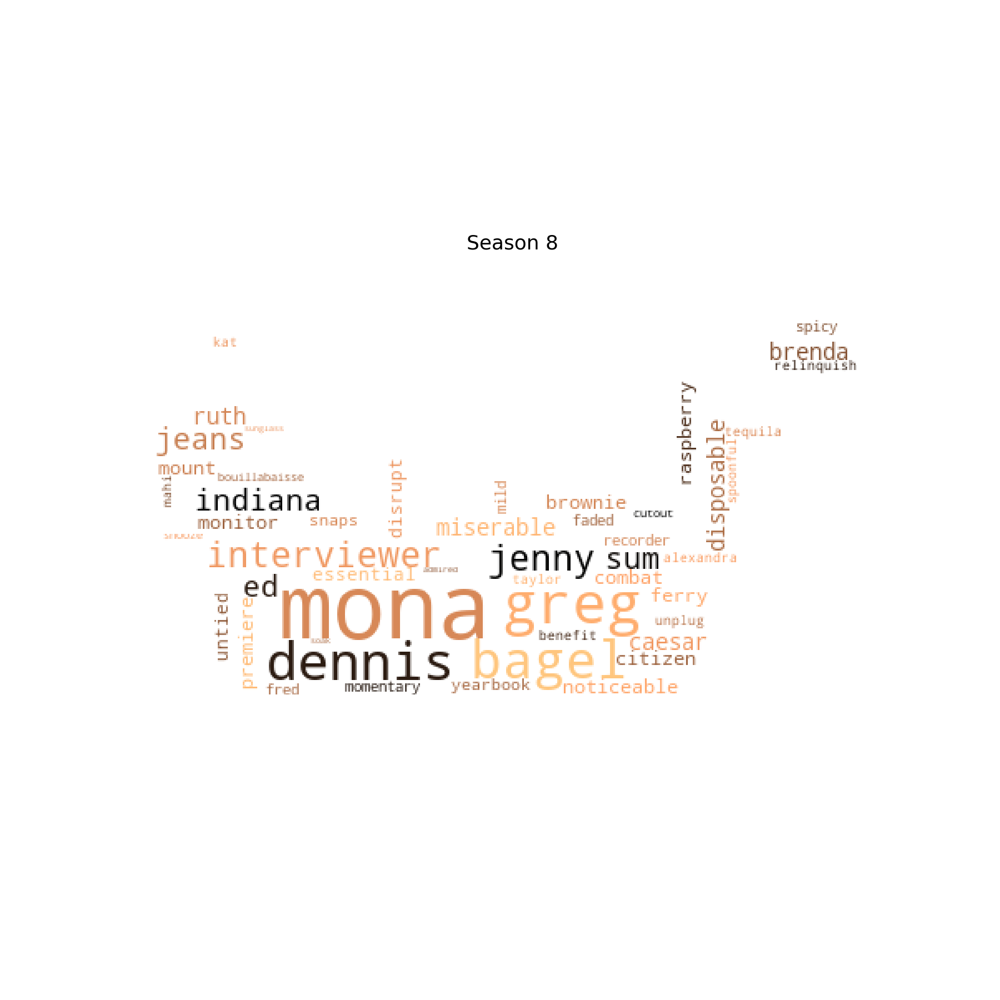
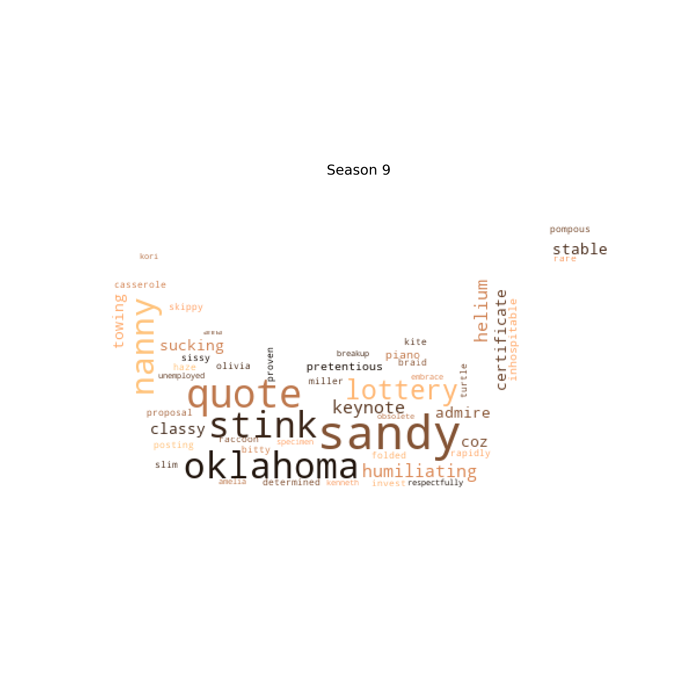
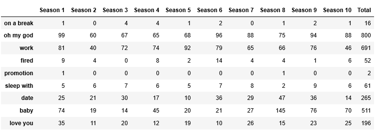
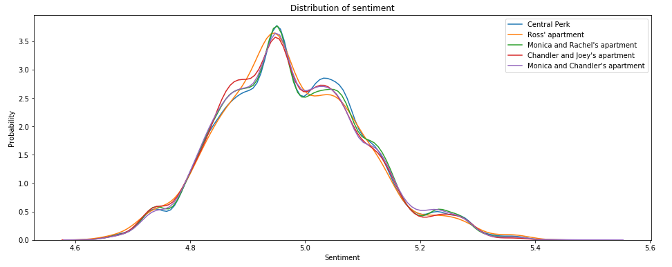

# Text Analysis

[Go Back](https://lunahub.github.io/Friends_social_data_analysis_2019/)

There has been a lot of discussion about who is the maincharacter in friends. 
If we look at the percentage of lines among the friends and who has the most lines, the maincharacter in the first three seasons is Ross with 20-21% of the lines. In season 4 and 5, Chandler is then the one with the most lines (17-5-18.4%), in season 6 it's shared between Rachel and Chandler who have 18.5-18.3% of the lines then in season 7, 8 and 9 Rachel takes over with 19.9-20.7% of the lines in 7 and 8 and then declines down to 17.4%. Season 9 is the season with the most evenly distribued number of lines between the friends. In the last season, Ross is back with the most lines (19.8%)
Script can be found [here](https://nbviewer.jupyter.org/github/LunaHub/Friends_social_data_analysis_2019/blob/master/Jupyter_notebook/Friends_says_season.ipynb)

 
	

Compared to the percentage where the friends are mentioned by each other, a similar pattern shows. Except for in season 7, Ross is the one who is mentioned most frequent. In total Ross is mentioned 2055 times. Monica is not mentioned that much but in season this changes and she is the one who is mentioned 22.4% of the time - this could be because she gets married to Chandler. 
The two people who mentions Monica the most in season 7 is Rachel who mentiones Monica 51 times and Chandler mentiones her name 85 times in the season.

 
	

The number of times that the characters says each others names can help to show their relationship
The friend that Joey mentiones the most in total is Ross (398) followed by Chandler (386). He doesn't have a serious relationship with any of the girls so it makes sense, that he talks the most with his two good friends.

The friend that Rachel mentiones the most in total is Ross (693) followed by Joey (388) and the friend that Ross mentiones the most in total is Rachel (429) followed by Joey (283) - here we also see that the loveinterest is the one who's name is used most frequent. Both Ross and Rachel mention Joey the most but the reason for this could be Joey's ability to get himself into trouble and stupid situations. Joss is also the one who mentions his own name the most - 186 times in total which is more times that he mentions Phoebe, whom he only mentions 165 times.
The friend that Chandler mentiones the most in total is Monica (369) followed by Joey (357)
So Chandler mentions his best friend almost as many times as his love interest.The friend that Monica mentiones the most in total is Chandler (461) followed by Phoebe (342). So Monica does talk a lot more about Chandler than he talks about her. Or another explanation could be, that Chandler more often uses a different name for Monica, like *Mon* or sweetheart. 

The friend that Phoebe mentiones the most in total is Monica (277) followed by Rachel (268) but in general she mentions the friends fairly evenly - the two she mentions the least are Joey and Chandler who she mentions 211 times for both.

We can also look at the secondary characters and determine how the characters relationship with them were. We can see that a guy named *Mike* is present in the first season but this is another guy with the samen name. He only becomes central in season 9 and 10 - espicially for Phoebe whom he marries.
Mike is the one whos name is mentioned the most by the friends - 201 times in total; half of the time by Phoebe. Compared to that Chandlers former girlfriend, Janice, known for exclaiming "*OH. MY. GOD!*" only gets mentioned 103 times.
The script can be found [here](https://nbviewer.jupyter.org/github/LunaHub/Friends_social_data_analysis_2019/blob/master/Jupyter_notebook/Friends_names_season.ipynb)
 

## Location
The friends are often at the café Central Perk. The one who speaks the most there is Phoebe followed by Ross. The scenes does not take place at their homes so it makes sense that they need to 'compensate'. 
At the homes of the friends, it's the ones who live there that speaks the most. At Ross' place it's Rachel that speaks the most, which makes sense because they have an on-off relationship.
At Monica and Rachel's apartment Joey comes to visit most often, at Chandler and Joey's apartment it's Ross who is the frequent visiter and at Monica and Chandler's apartment it's Joey who visits a lot - he's also used to be together with Chandler a lot because they used to live together. 

When looking at the sentiment for the five locations there isn't much of a difference. The place with the highest rate is Monica and Chandler's apartment but it's only at 5.49. The lowest sentiment is at 4.64 and that's the same for all the places except for Ross' apartment that's at 4.66.
Script for sentiment for location can be found [here](https://nbviewer.jupyter.org/github/LunaHub/Friends_social_data_analysis_2019/blob/master/Jupyter_notebook/Friends_sentiment_location.ipynb) and sentiment for the six friends can be found [here](https://nbviewer.jupyter.org/github/LunaHub/Friends_social_data_analysis_2019/blob/master/Jupyter_notebook/Friends_sentiment.ipynb)

## When the boys and the girls are alone

A lot of us probably wonders what the other sex talks about when they're alone. Well for the boys of the friends crew, they talk a lot about being naked! But also about laundry. They talk about Emma's first word, "Gleba" and dollhouse, about Chandler's married co-worker Wendy who wants to have sex with him and Monica's ex-boyfriend, Pete.

 
	

The boys also talks about being gay and the girls talk about lesbian. But mostly they talk about being french. They probably also talk a lot about their feelings about waiting and stay. They use words such as yelling, angry, hurting, unbelievable, keeping and decide.
They talk about Demi Moore and Dudley Moore when Phoebe confuses them with each other and ends up giving Monica a short, mannish cut. They talk about Jack which could be Jack Geller, Ross and Monica's dad or Jack Bing, one of Monica and Chandler's children.

 
	

The script can be found [here](https://nbviewer.jupyter.org/github/LunaHub/Friends_social_data_analysis_2019/blob/master/Jupyter_notebook/Friends_wordcloud_boysgirls.ipynb)

## Wordcloud for each character

### Rachel
Rachel is a uptown girl who is used to being taking care of. At the start of the show she has abbandoned her wealthy husband at the alter and tries taking back her freedom by denying her dad's money. During the seasons she becomes more independent and serious.
We see her more fancy past in words such as *novelty, Mercedes, Vogue, antique, gracious demand* and *gala* and the sorority *Kappa Kappa Delta* that she was a part of.
She uses her experience and love for *design* to get a job at Ralph Laurent where she use the word *litigious* to convince the interviewer to give her a chance to work there. 
We see how she works with things from her past; *copa cabana* is a part of the song "Copacabana by Barry Manilow" she sings when trying to face up to a bad childhood memory. *Shoop* is from a video of her as a child

 
	

### Ross
Ross is the geeky older brother. He is a paleontologist and is granted a *tenure*. He tries to share historic facts with the friends but they are not too keen to listen. He tries to tell the storie of the *Maccabees* but gets interrupted, he talks about the *mesozoic* era, *clay, sediment, carbon, gradiate alumni, profession*.

 
	

### Joey
Joey is the happy-go-lucky actor who never wants to grow up and loves food. We see this reflected in his words where he talks about *casting* a lot and also *script, unsuccessful, halfway* and *suffering*. He has some jobs in advertisement for instance as *the Aramis guy* Is fondness of cakes can also be seen in words such as *brownie* and *cheesecake*

 
	

### Monica
Monica is known for her obsessive cleanliness but also very caring and mothering towards the other characters - something in a bit too controling and bossy way. She likes to cook and the friends often hang out at her place.
We see her love for cooking in the wordcloud with words such as *swordfish, grilled, peel, caesar (salat), oyster, steaks, pate,  cocktails, lettuce* and *tomatos*. *Maurice* could refer to Joey's imaginary friend and 
Monica also really wants to have children with Chandler and they end up *adopt*ing. 

 
	

### Phoebe
Phoebe is not your average american girl. She had a rough childhood and started living on the streets of New York City by the age of 14. Due to this she has some crazy stories that really stands out from the rest of the friends group.
We can see that she uses more dramatic words like *madness*, *abandonment* and *hunger*
She cares deeply about the people around her but has some tragic figures in her life. *Earl* is a stranger she ends up convincing not to kill himself and develops a friendship with, *Debbie* is her friend who died in high school and Ellen is a friend who is in rehab at the time of her wedding.
She takes on rather creative activities at times. *Marcia* is her alias for Monica when she writes about him and Chandler, *platting* is from a song she sings

 
	

### Chandler
Chandler is an executive specialized in statistical analysis and data reconfiguration but frequently talks about how he dislikes his job. This is expressed in words such as *eyesore, slave, survive, anxiety* and *distraught*.

*Brian* is Chandler's attractive gay co-worker that Chandler declares he could get if he wanted to, *Nina* is another co-worker that he messes things up with - in both cases the word *offended* seems appropriate, *Aurora* is a polyamorous woman he dates 

 
	

The script can be found [here](https://nbviewer.jupyter.org/github/LunaHub/Friends_social_data_analysis_2019/blob/master/Jupyter_notebook/Friends_wordcloud_realwords.ipynb)

## Wordclout for seasons
For the wordcloud for season 4, we see that *Joshua* is an important character that only appears in this season. He is a client of Rachel when she works at Bloomingdale's as a personal shopper. She falls madly in love with him and tries to start a relationship with him with little luck until the end but ends up scaring him away due to her eagerness to get married. 
Phoebe also falls in love with a client named *Rick* that turns out to be married.

 
	

In season 8, Ross dates Monica's colleague *Mona* but their relationship get complicated when they find out that Rachel is pregnant with Ross' child. 
Chandler and Monica meet a couple, *Greg* and *Jenny* on their honeymoon. They act a bit obsessed with the other couple but it turns out that the feelings weren't reciprocated - they gave them a wrong number.
*Dennis* is Chandler's mum's date (a dear old friend and great lover) at Monica and Chandler's wedding. He works as a directer on a Broadway show and Joey gets obsessed with convincing him to cast him in his next show.

 
	

In season 9 Ross and Rachel looks for a *nanny* and ends up hiring a man named *Sandy*. Ross ends up firing him in the same episode because he gets freaked out by another man being *"too sensitive"*

 
	

The script can be found [here](https://nbviewer.jupyter.org/github/LunaHub/Friends_social_data_analysis_2019/blob/master/Jupyter_notebook/Friends_wordcloud_season.ipynb)

## Reoccuring themes

 
	

Things with Rachel and Ross has never been easy. In season 3, episode 6 "The One Where Ross and Rachel Take A Break" an ungoing discussion starts to wheter they were broken up or on a break. The sentence *"on a break"* gets mentioned in 14 different episodes by Ross, Rachel, Joey, Phoebe and even by Ross' son Ben, whom Rachel tries to convince of her side of the story.

 
	

It isn't only Janice who exclaims "*Oh My God!*" - it is said a total of 800 times in the show

A huge part of Friends focuses on their lovelife. The friends goes on various dates - especially in season 8 the word *date* is used a lot. The friends also get kids which can be seen from the frequency of the word *baby* that is most prominent in season 1 and 8-10.
Though the friends talk a lot about their work and the word is used 691 times in total, they don't get a lot of promotions - the word is only used two times; one time in season 1 and one time in season 9. Instead they talk about getting fired - especially in season 1 (9 times) and 6 (14 times)

 
	

## Sentiment
Although characters break up, get back together and have children, the sentiment doesn't show any such moodswings. It is for all characters, for all seasons and for the different locations kept pretty stable around 4.6-5.4

 
	

This makes sense due to the fact that the show is known to be easy entertainment that people don't get overwhelmed by bing-watching. If we were bombarted by hugh feelings every time they turned on the show it probably wouldn't be as popular. 

[Go Back](https://lunahub.github.io/Friends_social_data_analysis_2019/)
