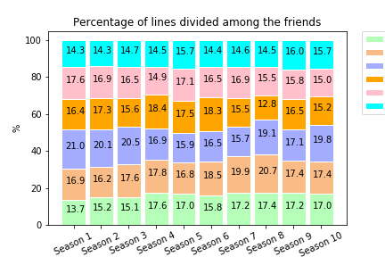
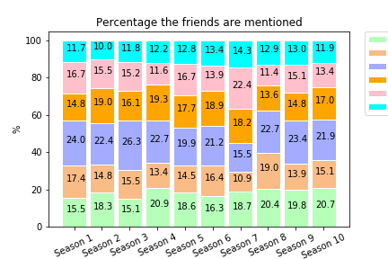
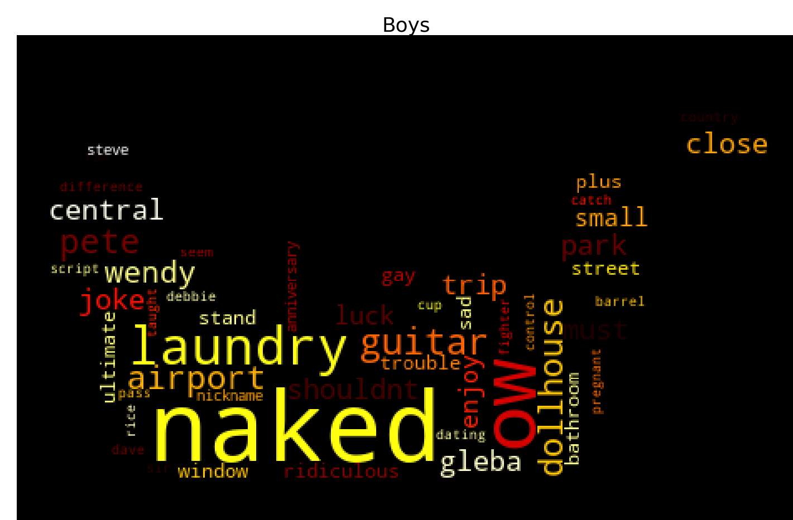
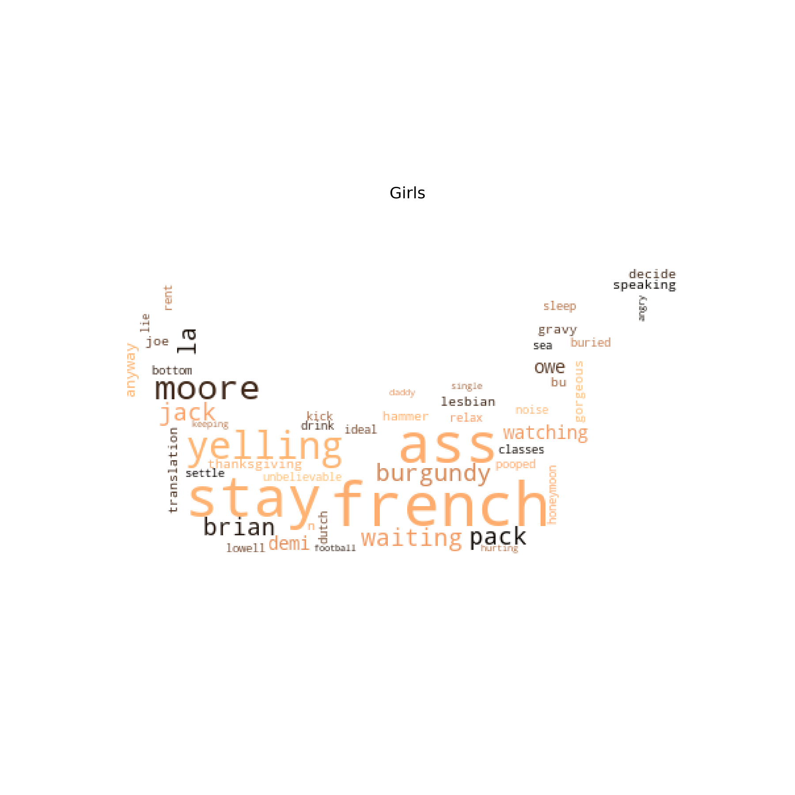
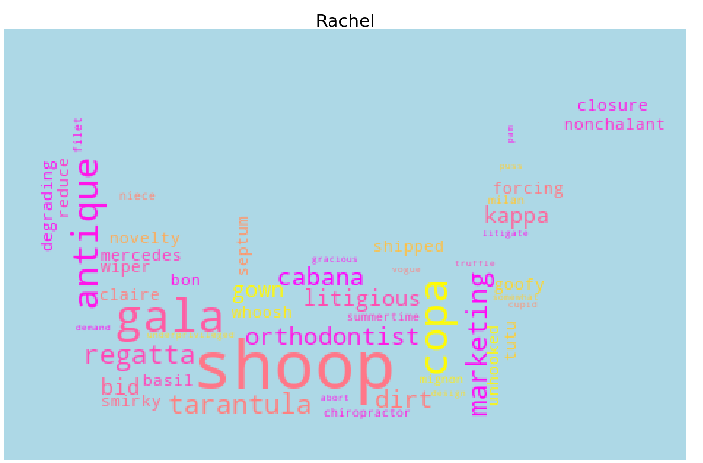
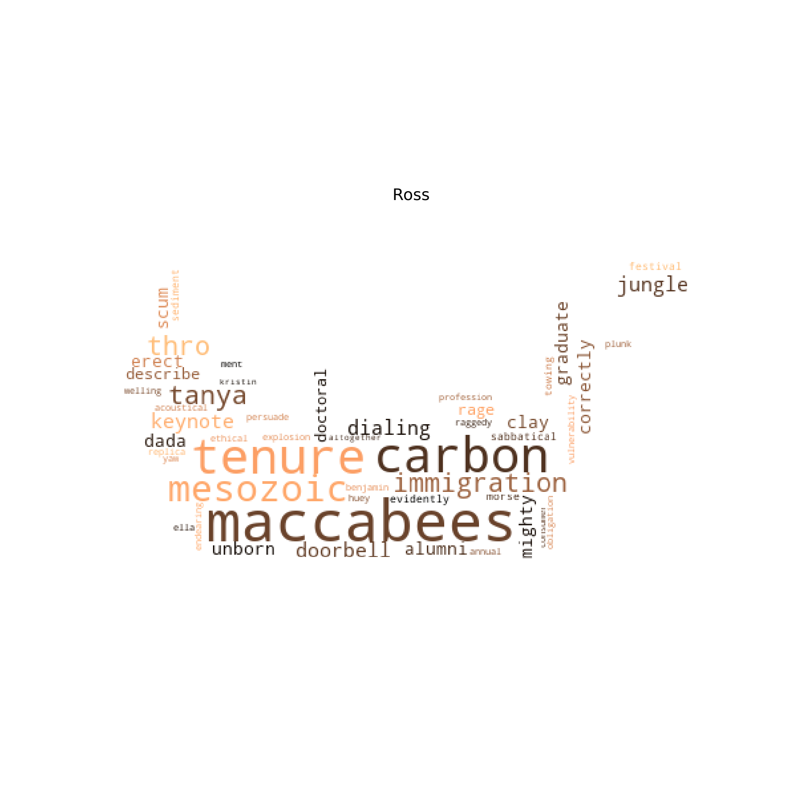
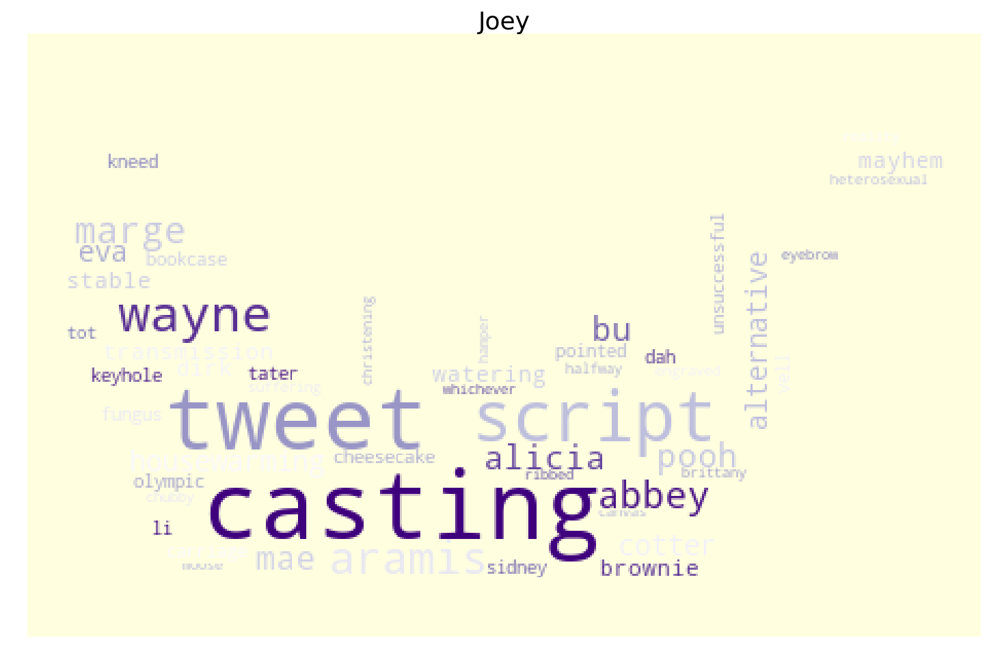
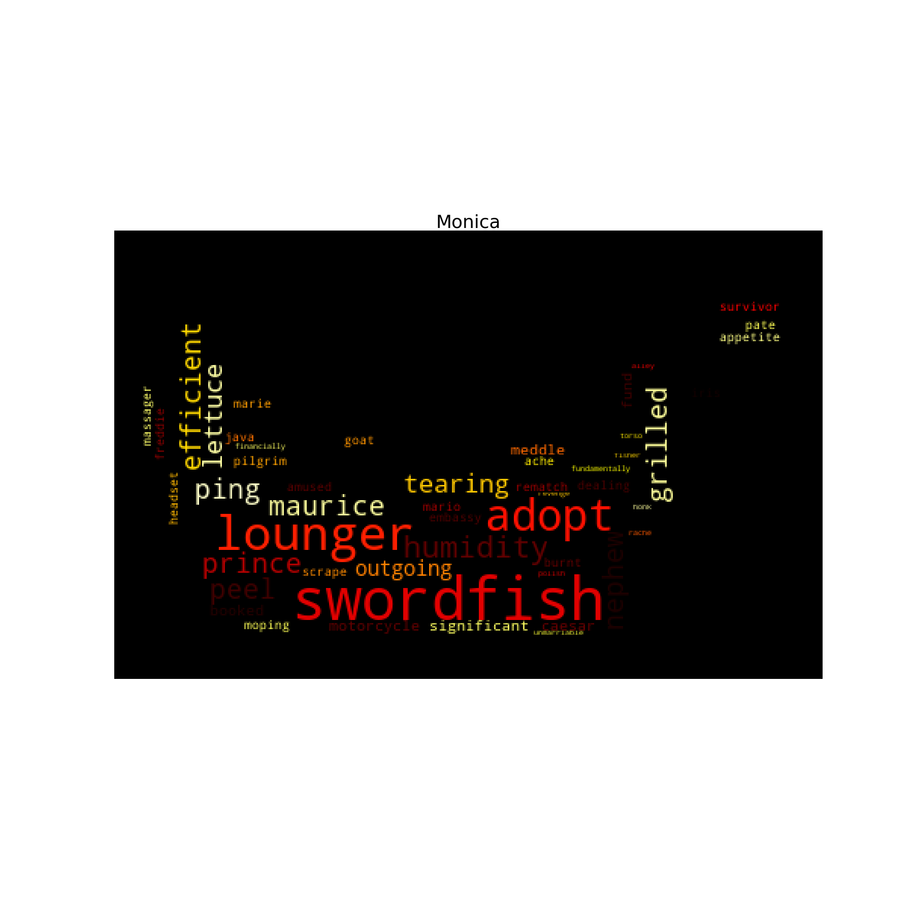

# Text Analysis

[Go Back](https://lunahub.github.io/Friends_social_data_analysis_2019/)

There has been a lot of discussion about who is the maincharacter in friends. 
If we look at the percentage of lines among the friends and who has the most lines, the maincharacter in the first three seasons is Ross with 20-21% of the lines. In season 4 and 5, Chandler is then the one with the most lines (17-5-18.4%), in season 6 it's shared between Rachel and Chandler who have 18.5-18.3% of the lines then in season 7, 8 and 9 Rachel takes over with 19.9-20.7% of the lines in 7 and 8 and then declines down to 17.4%. Season 9 is the season with the most evenly distribued number of lines between the friends. In the last season, Ross is back with the most lines (19.8%)

 
	

Compared to the percentage where the friends are mentioned by each other, a similar pattern shows. Except for in season 7, Ross is the one who is mentioned most frequent. Monica is not mentioned that much but in season this changes and she is the one who is mentioned 22.4% of the time - this could be because she gets married to Chandler.

 
	

The two people who mentions her the most in season 7 is Rachel who mentiones Monica 51 times and Chandler mentiones her name 85 times in the season.
In total Ross is mentioned 2055 times followed by Joey who is mentioned 1729 times.

The friend that Joey mentiones the most in total is Ross (398) followed by Chandler (386)

The friend that Rachel mentiones the most in total is Ross (693) followed by Joey (388)

The friend that Ross mentiones the most in total is Rachel (429) followed by Joey (283)

The friend that Chandler mentiones the most in total is Monica (369) followed by Joey (357)
So he mentions his best friend almost as many times as his love interest 

The friend that Monica mentiones the most in total is Chandler (461) followed by Phoebe (342)

The friend that Phoebe mentiones the most in total is Monica (277) followed by Rachel (268) but in general she mentions the friends fairly evenly - the two she mentions the least are Joey and Chandler who she mentions 211 times for both.

## Location
The friends are often at the café Central Perk. The one who speaks the most there is Phoebe followed by Ross. The scenes does not take place at their homes so it makes sense that they need to 'compensate'. 
At the homes of the friends, it's the ones who live there that speaks the most. At Ross' place it's Rachel that speaks the most, which makes sense because they have an on-off relationship.
At Monica and Rachel's apartment Joey comes to visit most often, at Chandler and Joey's apartment it's Ross who is the frequent visiter and at Monica and Chandler's apartment it's Joey who visits a lot - he's also used to be together with Chandler a lot because they used to live together. 

When looking at the sentiment for the five locations there isn't much of a difference. The place with the highest rate is Monica and Chandler's apartment but it's only at 5.49. The lowest sentiment is at 4.64 and that's the same for all the places except for Ross' apartment that's at 4.66.

## When the boys and the girls are alone

A lot of us probably wonders what the other sex talks about when they're alone. Well for the boys of the friends crew, they talk a lot about being naked! But also about laundry. They talk about Emma's first word, "Gleba" and dollhouse, about Chandler's married co-worker Wendy who wants to have sex with him and Monica's ex-boyfriend, Pete.

 
	

The boys also talks about being gay and the girls talk about lesbian. But mostly they talk about being french. They probably also talk a lot about their feelings about waiting and stay. They use words such as yelling, angry, hurting, unbelievable, keeping and decide.
They talk about Demi Moore and Dudley Moore when Phoebe confuses them with each other and ends up giving Monica a short, mannish cut. They talk about Jack which could be Jack Geller, Ross and Monica's dad or Jack Bing, one of Monica and Chandler's children.

 
	

## Wordcloud for each character

### Rachel
Rachel is a uptown girl who is used to being taking care of. At the start of the show she has abbandoned her wealthy husband at the alter and tries taking back her freedom by denying her dad's money. During the seasons she becomes more independent and serious.
We see her more fancy past in words such as *novelty, Mercedes, Vogue, antique, gracious demand* and *gala* and the sorority *Kappa Kappa Delta* that she was a part of.
She uses her experience and love for *design* to get a job at Ralph Laurent where she use the word *litigious* to convince the interviewer to give her a chance to work there. 
We see how she works with things from her past; *copa cabana* is a part of the song "Copacabana by Barry Manilow" she sings when trying to face up to a bad childhood memory. *Shoop* is from a video of her as a child

 
	

### Ross
Ross is the geeky older brother. He is a paleontologist and is granted a *tenure*. He tries to share historic facts with the friends but they are not too keen to listen. He tries to tell the storie of the *Maccabees* but gets interrupted, he talks about the *mesozoic* era, *clay, sediment, carbon, gradiate alumni, profession*.

 
	

### Joey
Joey is the happy-go-lucky actor who never wants to grow up and loves food. We see this reflected in his words where he talks about *casting* a lot and also *script, unsuccessful, halfway* and *suffering*. He has some jobs in advertisement for instance as *the Aramis guy* Is fondness of cakes can also be seen in words such as *brownie* and *cheesecake*

 
	

### Monica
Monica is known for her obsessive cleanliness but also very caring and mothering towards the other characters - something in a bit too controling and bossy way. She likes to cook and the friends often hang out at her place.
We see her love for cooking in the wordcloud with words such as *swordfish, grilled, peel, caesar (salat), oyster, steaks, pate,  cocktails, lettuce* and *tomatos*. *Maurice* could refer to Joey's imaginary friend and 
Monica also really wants to have children with Chandler and they end up *adopt*ing. 

 
	

### Phoebe
Phoebe is not your average american girl. She had a rough childhood and started living on the streets of New York City by the age of 14. Due to this she has some crazy stories that really stands out from the rest of the friends group.
We can see that she uses more dramatic words like *madness*, *abandonment* and *hunger*
She cares deeply about the people around her but has some tragic figures in her life. *Earl* is a stranger she ends up convincing not to kill himself and develops a friendship with, *Debbie* is her friend who died in high school and Ellen is a friend who is in rehab at the time of her wedding.
She takes on rather creative activities at times. *Marcia* is her alias for Monica when she writes about him and Chandler, *platting* is from a song she sings

 
	

### Chandler
Chandler is an executive specialized in statistical analysis and data reconfiguration but frequently talks about how he dislikes his job. This is expressed in words such as *eyesore, slave, survive, anxiety* and *distraught*.

*Brian* is Chandler's attractive gay co-worker that Chandler declares he could get if he wanted to, *Nina* is another co-worker that he messes things up with - in both cases the word *offended* seems appropriate, *Aurora* is a polyamorous woman he dates 
